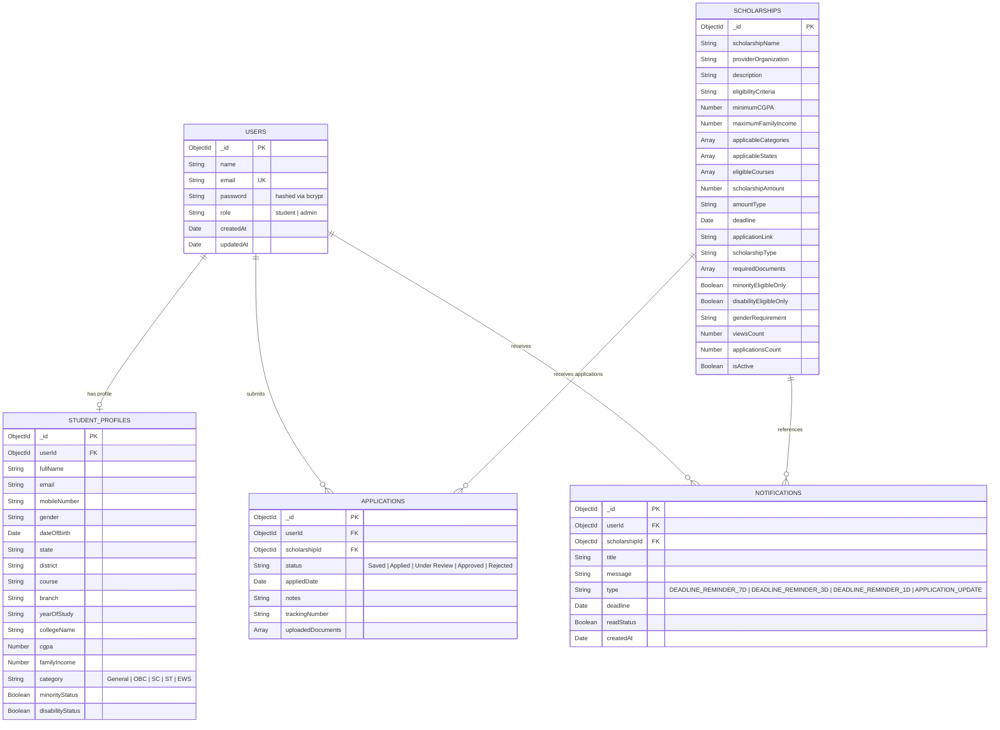

# Database Schema Documentation

**Project**: AI-Powered Smart Scholarship Finder and Eligibility Recommendation System  
**Database**: MongoDB (Mongoose ODM)

---

## 1. Entity Relationship (ER) Diagram

---

## 2. Collection Specifications

### 2.1 `users` Collection
Stores credential accounts for both students and portal administrators with bcrypt hashing.

| Field | Type | Constraint | Description |
| :--- | :--- | :--- | :--- |
| `_id` | ObjectId | Primary Key | MongoDB Unique Identifier |
| `name` | String | Required | Full Name |
| `email` | String | Unique, Required | Normalized lowercase email |
| `password` | String | Required | Bcrypt salt-10 encrypted password |
| `role` | String | Enum: `['student', 'admin']` | Access control role |
| `createdAt` | Date | Auto | Account creation timestamp |

### 2.2 `studentprofiles` Collection
Contains demographic, educational, social, and economic criteria required by the AI engine.

| Field | Type | Description |
| :--- | :--- | :--- |
| `userId` | ObjectId | 1-to-1 foreign key reference to `users._id` |
| `cgpa` | Number | Grade point average (0.00 to 10.00) |
| `familyIncome`| Number | Annual family income in INR (₹) |
| `category` | String | Social reservation: `General`, `OBC`, `SC`, `ST`, `EWS` |
| `state` | String | Domicile state (e.g., Maharashtra, Karnataka, Gujarat) |
| `course` | String | Enrolled degree program (B.Tech, MBBS, B.Sc, etc.) |
| `minorityStatus` | Boolean | Declared membership in notified minority community |
| `disabilityStatus` | Boolean | Registered Differently-Abled (PwD) candidate |

### 2.3 `scholarships` Collection
Structured repository of all published scholarship schemes.

| Field | Type | Description |
| :--- | :--- | :--- |
| `scholarshipName` | String | Official scheme title |
| `providerOrganization` | String | Government ministry, corporate foundation, or university |
| `minimumCGPA` | Number | Merit threshold (0 if none) |
| `maximumFamilyIncome`| Number | Economic need ceiling (₹) |
| `applicableCategories` | [String] | Eligible social groups (or `['All']`) |
| `applicableStates` | [String] | Geographic jurisdiction (or `['All India']`) |
| `deadline` | Date | Final application closing timestamp |
| `scholarshipAmount` | Number | Financial grant value in INR |
| `applicationLink` | String | Verified web URL for submission |

### 2.4 `applications` Collection
Maintains user engagement with scholarships across their lifecycle.

| Field | Type | Description |
| :--- | :--- | :--- |
| `userId` | ObjectId | Foreign key to `users` |
| `scholarshipId` | ObjectId | Foreign key to `scholarships` |
| `status` | String | `Saved`, `Applied`, `Under Review`, `Approved`, `Rejected` |
| `trackingNumber` | String | Unique generated applicant tracking code |
| `notes` | String | User custom application notes or interview feedback |

### 2.5 `notifications` Collection
Stores deadline reminders and application lifecycle alerts.

| Field | Type | Description |
| :--- | :--- | :--- |
| `userId` | ObjectId | Target recipient student |
| `scholarshipId` | ObjectId | Target scheme for deep-linking |
| `type` | String | Trigger code (`DEADLINE_REMINDER_7D`, `3D`, `1D`, etc.) |
| `readStatus` | Boolean | Read/Unread flag for dashboard badges |
