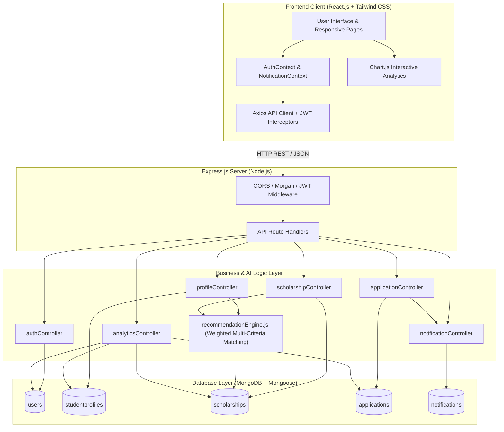
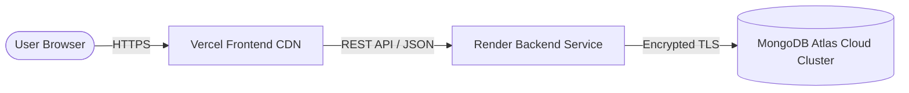

# System Architecture Documentation

**Project**: AI-Powered Smart Scholarship Finder and Eligibility Recommendation System  
**Pattern**: Model-View-Controller (MVC) + Decoupled Service Layer + Client-Side SPA

---

## 1. High-Level Architectural Diagram

---

## 2. Recommendation Engine Mathematical Formulation

The AI Recommendation Engine employs a multi-attribute decision scoring framework:

$$\text{Score}_{\text{total}} = w_{\text{acad}} \cdot S_{\text{acad}} + w_{\text{need}} \cdot S_{\text{need}} + w_{\text{cat}} \cdot S_{\text{cat}} + w_{\text{geo}} \cdot S_{\text{geo}} + w_{\text{crs}} \cdot S_{\text{crs}} + w_{\text{spec}} \cdot S_{\text{spec}}$$

Where weights $\sum w_i = 100$:

| Component | Weight | Mathematical Function | Description |
| :--- | :---: | :--- | :--- |
| **Academic** ($S_{\text{acad}}$) | 30% | If $\text{CGPA} \ge \text{CGPA}_{\text{req}}$, score is $25 + \min(5, 2(\text{CGPA} - \text{CGPA}_{\text{req}}))$. If lower, score is $\frac{\text{CGPA}}{\text{CGPA}_{\text{req}}} \times 15$. | Awards base threshold points with merit surplus bonus for high performers; applies proportional penalty for sub-threshold CGPA. |
| **Financial Need** ($S_{\text{need}}$) | 25% | If $\text{Income} \le \text{Income}_{\text{max}}$, score is 25. If exceeds within $1.2\times$, score is 10; otherwise 0. | Rewards need-based alignment below poverty/income ceiling thresholds. |
| **Category** ($S_{\text{cat}}$) | 20% | Binary mapping: $20$ if category matches or scheme is open to all; otherwise 0. | Ensures hard eligibility check for SC, ST, OBC, EWS schemes. |
| **Geography** ($S_{\text{geo}}$) | 10% | Binary mapping: $10$ if state domicile matches or All India; otherwise 0. | Distinguishes state-specific DBT awards from national schemes. |
| **Discipline** ($S_{\text{crs}}$) | 10% | Fuzzy substring match: $10$ if enrolled degree matches eligible course list; otherwise 0. | Matches Engineering, Medical, Science, Management streams. |
| **Special** ($S_{\text{spec}}$) | 5% | Minorities, Differently-Abled (PwD), and Gender inclusions. | Extra credit and eligibility confirmation for targeted programs. |

### Classification Tiers
- **Top Match**: Score $\ge 85\%$ (Meets all major criteria with high academic confidence)
- **High Match**: $70\% \le \text{Score} < 85\%$ (Meets criteria, strong candidate)
- **Eligible**: $50\% \le \text{Score} < 70\%$ (Borderline criteria or open competition)
- **Low Match**: $\text{Score} < 50\%$ (Hard criteria deficit or outside mandate)

---

## 3. Production Deployment Architecture

### Production Variables
- **Frontend (Vercel)**: `VITE_API_BASE_URL=https://api.scholarshipfinder.render.com/api`
- **Backend (Render)**: `MONGODB_URI=mongodb+srv://...`, `JWT_SECRET=...`, `NODE_ENV=production`
- **Database (Atlas)**: Multi-region M0/M10 replica set with automated backups.
